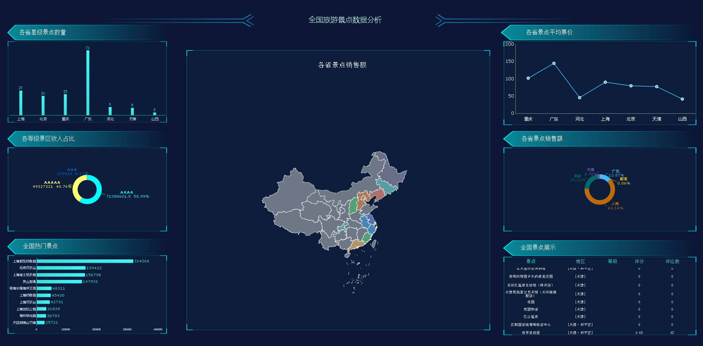
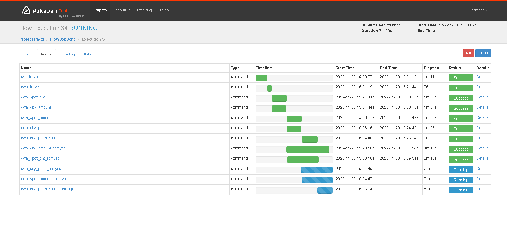
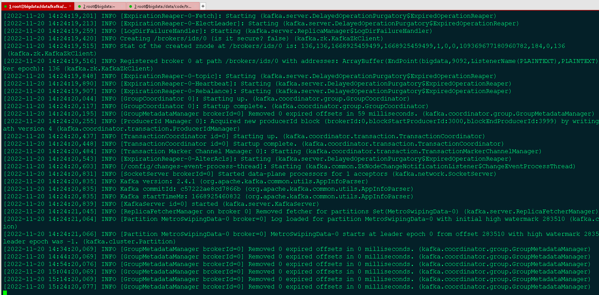
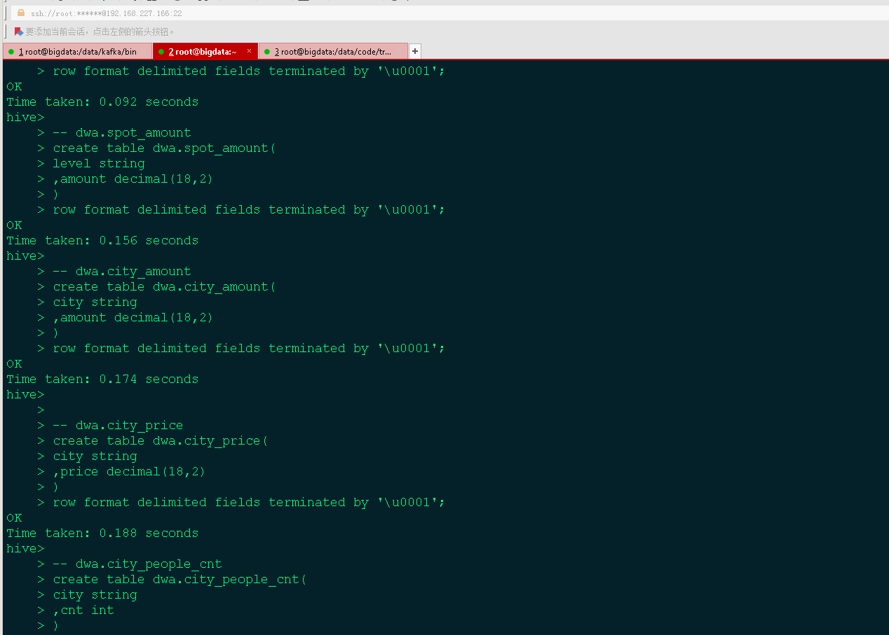
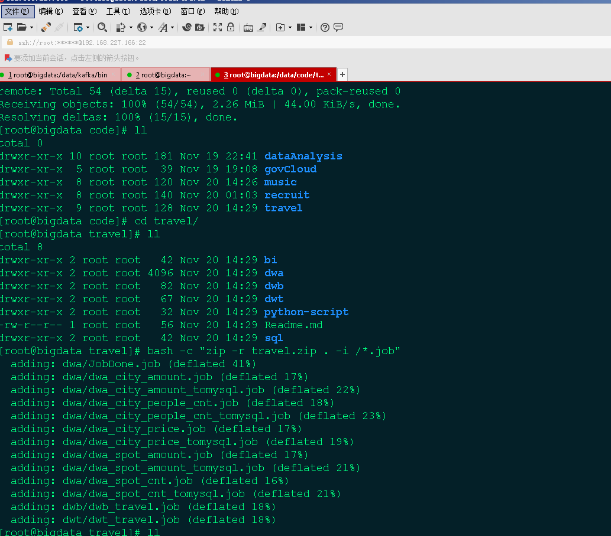

# 计算机毕业设计吊炸遥遥领先Python+Hadoop+Spark+Hive旅游可视化 旅游数据分析 数据仓库 旅游推荐系统 旅游大数据 大数据毕业设计 大数据毕设

## 要求
### 源码有偿一套(论文 PPT 源码+sql脚本+虚拟机)
### 
### 加好友前帮忙start一下，并备注github有偿获取源码
### 我的QQ号是2877135669 

### 或者 微信 bysj2023nb

### 加qq好友说明（被部分  网友整得心力交瘁）：
    1.加好友务必按照格式备注git虚拟机旅游
    2.避免浪费各自的时间

## 开发技术
python 3.6.6 

java  1.8 

scala 2.11 

kafka_2.11-2.4.1 

zookeeper_3.4.6 

flink 1.14.0 

hadoop 2.7.6 

sqoop 1.4.6 

hive 1.2.1 

azkaban 2.5.0 

mysql 5.7 

FineReport 11 

## 创新点

实时计算、离线计算、大屏、爬虫、虚拟机

## 补充说明
适合大数据毕业设计、数据分析、爬虫类计算机毕业设计

# 运行截图

# 演示视频

https://www.bilibili.com/video/BV15d4y1878w/?spm_id_from=333.999.0.0

或者去我B站搜关键词

https://space.bilibili.com/474562629